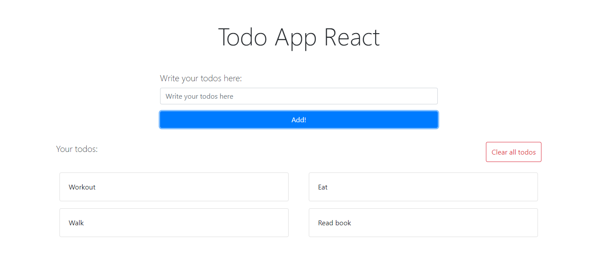
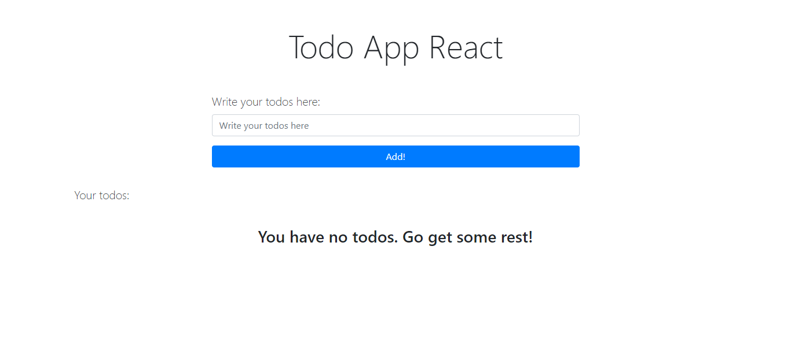
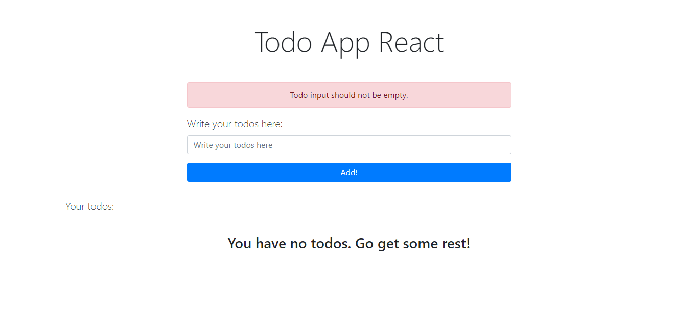
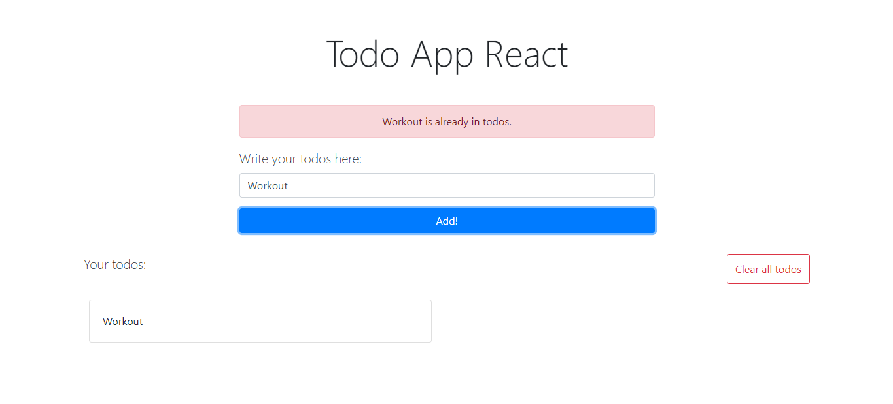

# Todo React App
[](https://clediscover.xyz)

[](https://github.com/clediscover/Todo-React-App/issues)
[](https://github.com/clediscover/Todo-React-App/network)
[](https://github.com/clediscover/Todo-React-App/stargazers)
[](https://github.com/clediscover/Todo-React-App/blob/master/LICENSE.md)

## Description
- A todo app that is made with **React**.

## Here are the things that you can do here:
  1. Add todo
  2. Clear all todos

## With and Without Todo
  ##### With
  
  
  ##### Without
  

## Adding Empty and Repeated Todo
  ##### Empty
  
  
  ##### Repeated
  

## Quick Start
  1. On terminal/CMD do the following command:
      ```
        git clone https://github.com/clediscover/Todo-React-App.git
      ``` 
  2. Go to the directory, where you've cloned, then open the "index.html".
  3. It's done!